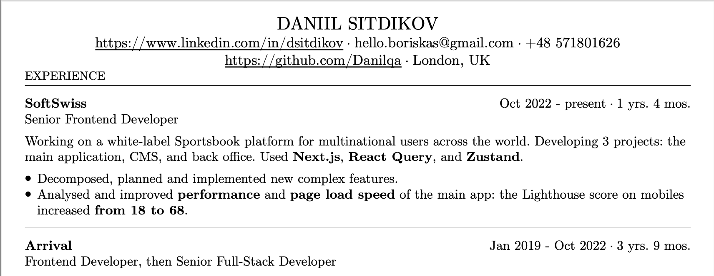

# CV PDF Template

This is a simple, elegant, and easy-to-use template for creating CV. It's powered by **React** and **React PDF**.
It accommodates a lot of content and designed to follow the best practices.

This CV is generated upon pushing to the main branch: [cv.pdf](https://danilqa.github.io/react-pdf-cv-template/cv.pdf)

Bookmark and help others discover this template! ⭐ Star it on GitHub.

## How to use

1. Fork this repository.
2. Install dependencies: `pnpm install`.
3. Start project in dev mode: `pnpm dev` and open: http://localhost:5173.
4. Fill you data here: `src/cv-document.tsx`.
5. Your PDF is ready! Download it by clicking the button on website.

## How to deploy

1. Set up your GitHub Pages in the settings of your repository.
2. After successful deployment, you can access your CV by the following link: 
`https://<your-github-username>.github.io/<your-repository-name>/cv.pdf`.

## Features

1. Calculation of work experience duration.
2. Ready for integration with release pipelines. A PDF generation script is included, allowing for an always up-to-date 
CV on your website following a push to the main branch.

## Motivation

1. Many online templates and services look beautiful but aren't functional enough. They have too many unnecessary 
things like avatar, skill scores, and company logos. This takes up too much space, so it's hard to fit all the important information on one page. Also, these kinds of resumes are often not easy for computer programs to read.
2. With other services, you can't keep track of changes, and you have to enter all your information through forms.
3. You can't change layout easily, and if you need to make changes later, you often have to use complicated
tools like LaTeX.

## Structure

1. `src/cv-document.tsx` - main file for your CV. You can fill your data here.
2. `src/elements` - folder with atomic elements for your CV: bullet, list, bold, etc.
3. `src/sections` - folder with complex sections for your CV: header and experience.

## Credits

1. Template inspiration: [resumake.io](https://github.com/saadq/resumake.io)
